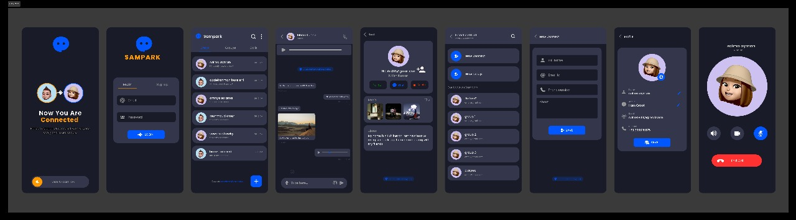

# **Sampark Chat Application — Full Documentation**

## **1. Introduction**
Sampark Chat is a real-time messaging application built to provide seamless, fast, and modern communication. The app allows users to interact through private chats, group messaging, and multimedia sharing with a clean and intuitive user interface.

This documentation outlines the full system, including project idea, architecture, user journey, wireframes, database design, technology stack, development workflow, and team contributions.

---

## **2. Project Overview**
### **2.1 Project Idea**
Sampark Chat aims to deliver an easy-to-use, reliable, and modern messaging platform supporting:
- One-to-one chat
- Group messaging
- Real-time notifications
- User presence status
- Multimedia sharing (images, voice notes)
- Basic voice & video calling capabilities

### **2.2 Project Objectives**
- Build a scalable chat system using Firebase services.
- Provide smooth user experience with an intuitive UI/UX.
- Support media-rich communication.
- Maintain fast and secure data processing.

---

## **3. Design & User Interface**

### **3.1 Figma Design**
Our complete UI/UX design and prototypes are available on Figma:

**[View Figma Design](YOUR_FIGMA_LINK_HERE)**

The design includes:
- Complete user flow from onboarding to messaging
- All screen layouts and interactions
- Color scheme and typography guidelines
- Component library for consistent UI elements

### **3.2 App Design**

  <tr>
    <td> <b></b></td>

  </tr>

---

## **4. User Journey**
### **4.1 Onboarding Flow**
1. **Splash Screen** — App logo animation.
2. **Welcome Screen** — Option to log in or create an account.
3. **Account Creation** — Email/password authentication.
4. **Profile Setup** — User uploads profile image and sets display name.
5. **Redirect to Home Screen** — User lands on chat list.

### **4.2 Core User Actions**
- **Open Chats** → View active conversations.
- **Start New Chat** → Search user → Create chat.
- **Send Message** → Text, emoji, images, voice notes.
- **Group Chat** → Create group → Add members → Send messages.
- **Make Calls** → Basic voice/video feature.
- **Settings Menu** → Update account, change theme, privacy settings.

---

## **5. Wireframes (Concept Overview)**
### **5.1 Home Screen**
- Chat list sorted by most recent messages.
- Floating button for starting a new chat.

### **5.2 Chat Screen**
- Text input field.
- Attachment options: images, voice notes.
- Messages displayed with timestamps.
- Typing indicator and user online status.

### **5.3 Settings Screen**
- Profile details.
- Notifications settings.
- Privacy options.
- Logout.

### **5.4 Group Chat Screen**
- Group name and icon.
- Member list.
- Media sharing.
- Admin control (for future versions).

---

## **6. Features Breakdown**
### **6.1 Core Features**
- **Real-time chatting** using Firebase Cloud Firestore.
- **User authentication** via Firebase Auth.
- **Online/offline presence tracking.**
- **Push notifications** for new messages.

### **6.2 Media Features**
- Image upload via Firebase Storage.
- Voice message recording and upload.

### **6.3 Calling Features**
- Basic implementation of voice/video calls (WebRTC or Firebase integration).

### **6.4 User Settings**
- Change username.
- Change profile picture.
- Manage notification preferences.

---

## **7. Database Architecture**
Sampark Chat uses Firebase's NoSQL real-time database optimized for scalability.

### **7.1 Key Collections**
- **Users**
  - userId
  - name
  - email
  - profileImage
  - status

- **Chats**
  - chatId
  - members[]
  - lastMessage
  - timestamp

- **Messages**
  - senderId
  - messageType (text/image/voice)
  - content
  - timestamp

### **7.2 Data Flow**
1. **User enters data** in the mobile app.
2. **Firebase Auth** manages identity.
3. **Chat messages stored** in Firestore under chats/messages collections.
4. **Media files stored** in Firebase Storage.
5. **App retrieves messages** in real-time using snapshot listeners.

### **7.3 Security**
- Firebase security rules protect read/write operations.
- User-specific access control in chats.
- Authentication required for all operations.

---

## **8. Technology Stack**
### **Frontend**
- **Flutter** — Cross-platform mobile UI.
- **Dart** — Main programming language.

### **Backend & Storage**
- **Firebase Authentication** — Secure login.
- **Firebase Firestore** — Real-time database.
- **Firebase Storage** — Store media.
- **Firebase Cloud Messaging** — Notifications.
- **Node.js (optional)** — Used for advanced backend logic.

### **State Management**
- **GetX** — Lightweight and fast state management, navigation, and dependency injection.

---

## **9. Development Progress & Testing**
### **9.1 Development Stage**
- Login and authentication completed.
- User profile and settings functional.
- One-to-one chat fully working.
- Group chat system functional.
- Media sharing implemented.
- Basic calling implemented.

### **9.2 Testing**
- **Unit Testing** for message sending, media uploads, and authentication.
- **Integration Testing** for chat flows and UI interactions.
- **UAT (User Acceptance Testing)** conducted with selected testers.
  - Positive feedback on UI and flow.
  - Minor UI adjustments noted.

---

## **10. Project Timeline & Milestones**
| Milestone | Description | Deadline |
|----------|-------------|----------|
| Project Proposal | Define objectives and tools | Sep 15, 2025 |
| UI/UX & System Design | Architecture and Figma wireframes | Oct 1, 2025 |
| Core Development | Chat, Auth, Firebase setup | Oct 15, 2025 |
| Advanced Features | Images, voice, video | Oct 25, 2025 |
| Testing & Debugging | Fix issues and optimize | Nov 22, 2025 |
| Final Submission | Full presentation & documentation | Nov 29, 2025 |

---

## **11. Team Members & Roles**

Abdulrahman Hussieni Abdullah serves as the team leader and is responsible for UI/UX design, authentication implementation, and user chat functionality. Mahmoud Ahmed Abdelghani handles authentication and group chat features. Omar Mohamed Elsayed works on both user chat and group chat components.

---

## **12. Conclusion**
Sampark Chat represents a fully functional, scalable, and modern messaging platform. With a robust backend, intuitive UI design, and well-structured architecture, the app is ready for real-world deployment and future enhancements.

Thank you for reviewing the documentation.

---

## **13. Project Links**
- **GitHub Repository**: [View Source Code](https://github.com/abdulrahman-hussieni/SwiftChat)
- **Figma Design**: [View UI/UX Design](YOUR_FIGMA_LINK_HERE)
- **Demo Video**: [Watch Demo](YOUR_VIDEO_LINK_HERE)
